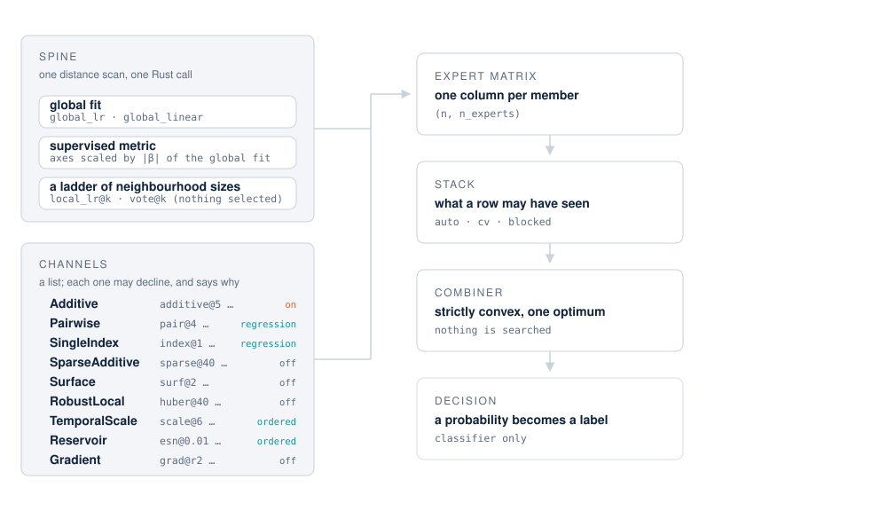

<p align="right" class="gh-only">
  <a href="index.md">
    <picture>
      <source media="(prefers-color-scheme: dark)" srcset="assets/atlas-mark-dark.svg">
      
    </picture>
  </a>
</p>

# Concepts

## What a fit builds

One **spine**, a list of **channels**, and the stages that turn the result into an answer.



The spine is not a list and cannot be one: a single Rust call serves every rung from one distance
scan and returns the local fits and the neighbour votes together, the metric's axes are the
global fit's own coefficients, and the local fits take the global prediction as their prior.
Splitting it apart would buy symmetry at the price of a second full distance scan.

Everything above the spine is a channel, and a channel is an object with three methods and two
optional answers. Adding one is a normal afternoon's work — see [extending
it](tutorials/extending.md).

## Why a library instead of a model

Each member converges at a different rate, so each owns a different kind of structure.

- **Local fits** own smooth, low-dimensional structure, and pay for generality: their rate
  degrades as the number of features grows.
- **An additive fit** converges at the one-dimensional rate whatever `p` is, so it owns exactly
  the regime where the local fits are weakest — plain axis-aligned tabular data.
- **The neighbour vote** owns the case where a local fit cannot be identified at all.
- **Each optional channel** owns one more regime; the [choosing](choosing.md) page says which.

None of these is selected. A ladder of neighbourhood sizes means no bandwidth has to be chosen;
a ladder of knot counts means no smoothness has to be chosen. The combiner mixes them, and the
mixture is what a Super Learner's oracle inequality is about: the combination is asymptotically
no worse than the best member you could have chosen in hindsight.

That is also why *adding* a member is the way this model improves, and why refining how members
are combined is not. Eleven combination rules were measured — gates, routers, simplex,
exponential weights, GAM, tree, MLP — and none beat plain convex stacking.

## The stack: what a row is allowed to have seen

The combiner's weights have to be learned from predictions that did not see the row they are
predicting. How that is arranged is a real decision, and the [choosing](choosing.md) page walks
through `auto`, `cv` and the ordered stacks with the trade-offs. The short version:

- **`auto`** (default) fits one library and recomputes each row's prediction without that row,
  in closed form. No folds, no seed dependence, and every member has seen `n-1` rows.
- **`cv`** fits one library per fold. A channel without an honest closed form forces it.
- **`Blocked` / `RollingOrigin`** are for rows in time order, and refuse the closed form on
  purpose: excluding row `i` alone is no exclusion when its neighbours in time are nearly itself.

## The four properties the design protects

**Determinism.** Two fits on the same data give the same model, down to the bit — weights,
probabilities and threshold. There is no hyper-parameter search, the combiner has a unique
optimum, the vote weights are a closed form, and the shrinkage is closed-form empirical Bayes.
Even the one channel with a random-looking component uses a fixed, deterministic construction
rather than a draw.

**Exact attribution.** Every prediction splits into one number per feature, and the identity is
checked to machine precision rather than asserted. Members that cannot participate are booked as
opaque and reported as such. This property is load-bearing: it is the reason a member that would
have scored better is not in the library, because it cannot be split per row and per feature.

**Honesty about leakage.** Anything supervised is fitted inside the fold — the categorical
encoder, the gradient channel's anchors. Fitted on a target independent of the features,
held-out performance sits at chance in every configuration, and no single member beats chance
either. That audit runs in the test suite.

**Nothing is printed.** Progress goes through `logging`, a concern is a typed warning, a refusal
is an exception. A channel that cannot build anything says so by name and with a reason.

## What `attribution()` returns

```python
import numpy as np
from atlas import AtlasRegressor

rng = np.random.default_rng(0)
X = rng.normal(size=(400, 6))
y = np.tanh(X[:, 0]) + 0.7 * X[:, 1] - 0.4 * X[:, 2] + 0.3 * rng.normal(size=400)

m = AtlasRegressor().fit(X, y)
a = m.attribution(X[:20])
```

| key | meaning |
|---|---|
| `shape` | `(n, p)` — one contribution per feature, per row |
| `surface` | one column per selected interaction; present always, empty when there are none |
| `baseline` | the level of each row's own neighbourhood plus fitted intercepts — nobody's feature |
| `per_expert` | each member's signed contribution |
| `feature_share`, `baseline_share`, `opaque_share` | fractions of one total, adding to one |

`baseline` is deliberately kept out of `shape`. It is not a residual — it is the level the row's
own neighbourhood sits at — and folding it into the per-feature split would read as feature
attribution when it is not. How much of a prediction the per-feature split covers varies
enormously between datasets, which is exactly why `opaque_share` and `baseline_share` are
reported beside it instead of being hidden.

## One thing to be careful about

`fold_report_`, and the metric `summary()` prints, are **in-fold** diagnostics. They are cut with
the same folds that built the expert matrix, so the weights being scored have already seen those
labels through the matrix. The number is optimistic, systematically, and by an amount that
matters at small `n`.

It is labelled that way in the output for a reason. To know how the model will do on new data,
hold data out yourself.
